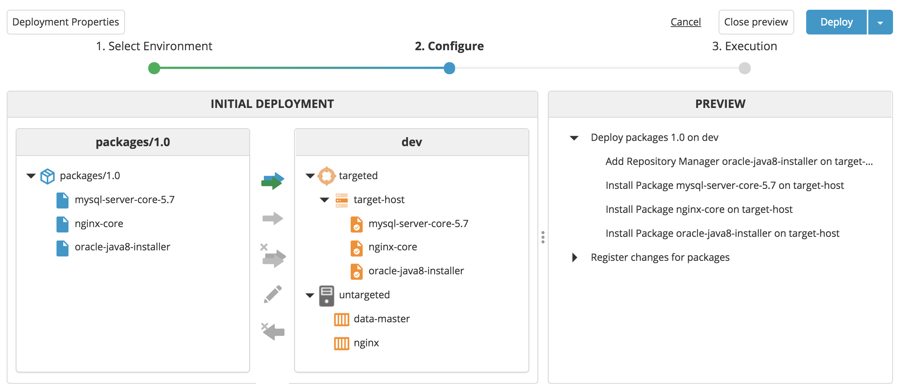
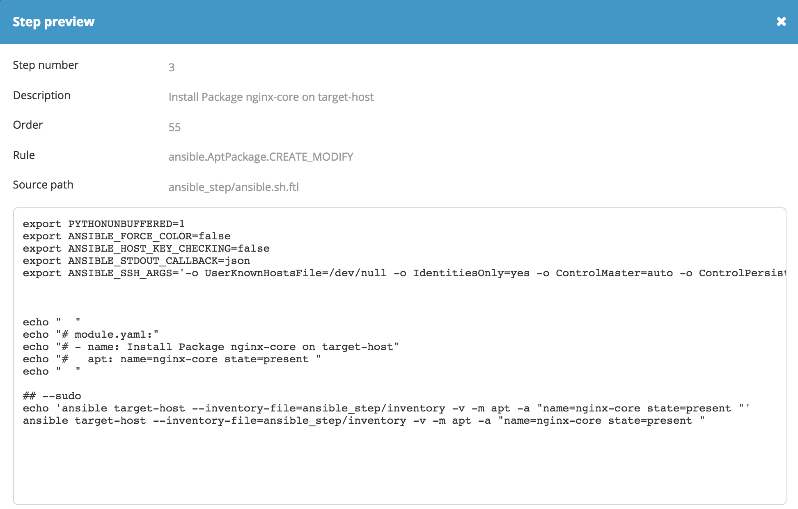

# XL Deploy Ansible Step plugin 

[![Build Status][xld-ansible-step-plugin-travis-image]][xld-ansible-step-plugin-travis-url]
[![License: MIT][xld-ansible-step-plugin-license-image]][xld-ansible-step-plugin-license-url]
![Github All Releases][xld-ansible-step-plugin-downloads-image]

[xld-ansible-step-plugin-travis-image]: https://travis-ci.org/xebialabs-community/xld-ansible-step-plugin.svg?branch=master
[xld-ansible-step-plugin-travis-url]: https://travis-ci.org/xebialabs-community/xld-ansible-step-plugin
[xld-ansible-step-plugin-license-image]: https://img.shields.io/badge/License-MIT-yellow.svg
[xld-ansible-step-plugin-license-url]: https://opensource.org/licenses/MIT
[xld-ansible-step-plugin-downloads-image]: https://img.shields.io/github/downloads/xebialabs-community/xld-ansible-step-plugin/total.svg

## Preface

This document describes the functionality provided by the XL Deploy Ansible Step plugin..

See the [XL Deploy reference manual](https://docs.xebialabs.com/xl-deploy) for background information on XL Deploy and deployment automation concepts.  

## Overview

The xld-ansible-step-plugin plugin is a XL Deploy plugin that adds capability to use call [Ansible](https://www.ansible.com/) module as a step.

## Requirements

* **XL Deploy requirements**
	* **XL Deploy**: version 5.5+
	
## Installation

* Copy the latest JAR file from the [releases page](https://github.com/xebialabs-community/xld-ansible-step-plugin/releases) into the `XL_DEPLOY|RELEASE_SERVER/plugins` directory.
* Restart the XL Deploy|Release server.

## Usage

This plugin provide a new <ansible> step that can be used by any [rules](https://docs.xebialabs.com/xl-deploy/how-to/use-a-predefined-step-in-a-rule.html).
 
# Step Parameters

| Parameter        | Type           | Description  | Required |
| ------------- |:-------------:| :-----| ---:|
| description | String | Step description | Yes |
| order | integer | Step order | Yes |
| modulename | String | Ansible Module Name | Yes |
| moduleargs | String | Ansible Module Arguments | Yes |


## Example

This XLDeploy type allow to define Ubuntu package to be deployed on a remote host.

```
 <type type="ansible.AptPackage" extends="udm.BaseDeployed" deployable-type="ansible.AptPackageSpec" container-type="overthere.Host" description="Deploy a system package using ansible">
    <generate-deployable type="ansible.AptPackageSpec" extends="udm.BaseDeployable"/>
    <property name="kind" default="apt"/>
    <property name="repository" required="false"/>
  </type>

```

The associated rule is using the <ansible> step using the [apt](https://docs.ansible.com/ansible/latest/modules/apt_module.html) Ansible Module 

```
 <rule name="ansible.AptPackage.CREATE_MODIFY" scope="deployed">
    <conditions>
      <type>ansible.AptPackage</type>
      <operation>CREATE</operation>
      <operation>MODIFY</operation>
    </conditions>
    <steps>
      <ansible>
        <description expression="true">"Install Package %s on %s" % (deployed.name, deployed.container.name)</description>
        <order>55</order>
        <modulename expression="true">deployed.kind</modulename>
        <moduleargs expression="true">{'name':deployed.name, 'state':'present'}</moduleargs>
      </ansible>
    </steps>
  </rule>

``` 

The rule to add a new apt ppa repository still using the [apt_repository](https://docs.ansible.com/ansible/latest/modules/apt_repository_module.html) Ansible Module

```
 <rule name="ansible.AptPackage.CREATE_MODIFY_if_repository" scope="deployed">
    <conditions>
      <type>ansible.AptPackage</type>
      <operation>CREATE</operation>
      <operation>MODIFY</operation>
      <expression>deployed.repository is not None</expression>
    </conditions>
    <steps>
      <ansible>
        <description expression="true">"Add Repository Manager %s on %s" % (deployed.name, deployed.container.name)</description>
        <order>52</order>
        <modulename>apt_repository</modulename>
        <moduleargs expression="true">{'repo':deployed.repository, 'state':'present'}</moduleargs>
      </ansible>
    </steps>
  </rule>

```







